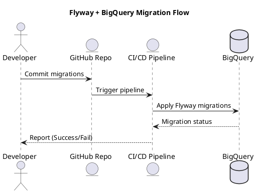

# ✅ Flyway  – Estrutura de Migrations e CI/CD

Este projeto demonstra como usar **Flyway** para versionamento de esquema e tabelas no **Google BigQuery**, incluindo:

✔ Estrutura de pastas  
✔ Exemplo de migrations  
✔ Configuração `flyway.conf`  
✔ Execução local  
✔ Pipeline CI/CD (GitHub Actions e Azure DevOps)  
✔ Fluxo visual com PlantUML  

---

## 📂 Estrutura do Projeto

```
flyway-bigquery/
├── migrations/                # Scripts SQL versionados pelo Flyway
│   ├── V1__create_dataset.sql
│   ├── V2__create_table_customers.sql
│
├── conf/
│   ├── flyway.conf            # Configuração do Flyway
│
├── scripts/
│   ├── run-migrations.sh      # Script para rodar migrations
│
├── ci-cd/
│   ├── github-actions.yml     # Pipeline GitHub Actions
│   ├── azure-pipelines.yml    # Pipeline Azure DevOps
│
├── docs/
│   ├── flow.puml              # Diagrama do fluxo com PlantUML
│
└── README.md                  # Este documento
```

---

## 🚀 **Por que usar Flyway com BigQuery?**
- Controle de versão para datasets e tabelas.
- Histórico centralizado (`flyway_schema_history`).
- Automação em pipelines CI/CD.
- Evita migrações manuais e inconsistências.

---

## ⚙️ **Configuração**

### **1. Instalar Flyway**
Baixe a versão mais recente:
```bash
curl -L https://repo1.maven.org/maven2/org/flywaydb/flyway-commandline/9.16.0/flyway-commandline-9.16.0-linux-x64.tar.gz | tar xz
sudo ln -s `pwd`/flyway-9.16.0/flyway /usr/local/bin/flyway
```

---

### **2. Configurar `flyway.conf`**
Arquivo em `conf/flyway.conf`:

```properties
flyway.url=jdbc:bigquery://https://www.googleapis.com/bigquery/v2:443;ProjectId=my-project;DefaultDataset=my_dataset;OAuthType=0;OAuthServiceAcctEmail=my-service-account@my-project.iam.gserviceaccount.com;OAuthPvtKeyPath=/secrets/key.p12;OAuthPvtKeyPassword=notasecret
flyway.user=my-service-account@my-project.iam.gserviceaccount.com
flyway.locations=filesystem:./migrations
flyway.schemas=my_dataset
flyway.table=flyway_schema_history
```

> ✅ **Autenticação via JSON**:  
Defina a variável de ambiente:
```bash
export GOOGLE_APPLICATION_CREDENTIALS=/caminho/key.json
```

---

## 🛠 **Exemplo de Migrations**

**`migrations/V1__create_dataset.sql`**
```sql
CREATE SCHEMA IF NOT EXISTS my_dataset;
```

**`migrations/V2__create_table_customers.sql`**
```sql
CREATE TABLE IF NOT EXISTS my_dataset.customers (
    customer_id STRING,
    name STRING,
    created_at TIMESTAMP
);
```

---

## ▶ **Executando Migrations Localmente**
```bash
flyway -configFiles=conf/flyway.conf migrate
```

**Com script:**
```bash
./scripts/run-migrations.sh
```

---

## 🔄 **Pipeline CI/CD**

### ✅ **GitHub Actions (`ci-cd/github-actions.yml`)**
```yaml
name: Flyway BigQuery Migration

on:
  push:
    branches: [ "main" ]

jobs:
  migrate:
    runs-on: ubuntu-latest
    steps:
      - uses: actions/checkout@v3

      - name: Instalar Flyway
        run: |
          curl -L https://repo1.maven.org/maven2/org/flywaydb/flyway-commandline/9.16.0/flyway-commandline-9.16.0-linux-x64.tar.gz | tar xz
          sudo ln -s `pwd`/flyway-9.16.0/flyway /usr/local/bin/flyway

      - name: Configurar credenciais GCP
        env:
          GOOGLE_APPLICATION_CREDENTIALS: ${{ github.workspace }}/gcp-key.json
        run: |
          echo '${{ secrets.GCP_KEY }}' > gcp-key.json

      - name: Rodar migrations
        run: ./scripts/run-migrations.sh
```

---

### ✅ **Azure DevOps (`ci-cd/azure-pipelines.yml`)**
```yaml
trigger:
  branches:
    include:
      - main

pool:
  vmImage: 'ubuntu-latest'

steps:
  - checkout: self

  - script: |
      curl -L https://repo1.maven.org/maven2/org/flywaydb/flyway-commandline/9.16.0/flyway-commandline-9.16.0-linux-x64.tar.gz | tar xz
      sudo ln -s `pwd`/flyway-9.16.0/flyway /usr/local/bin/flyway
    displayName: 'Instalar Flyway'

  - script: |
      echo '$(GCP_KEY)' > gcp-key.json
      export GOOGLE_APPLICATION_CREDENTIALS=$(System.DefaultWorkingDirectory)/gcp-key.json
      ./scripts/run-migrations.sh
    displayName: 'Executar migrations'
```

---

## ✅ **Fluxo Visual (PlantUML)**



---

## ✅ **Melhores Práticas**
- Sempre criar migrations idempotentes (`IF NOT EXISTS`).
- Usar **datasets diferentes** para ambientes (dev, stage, prod).
- Integrar com **notificações** (Slack, e-mail) no pipeline.
- Revisar scripts antes de aplicar em produção.

---

## ✅ **Rollback**
BigQuery não suporta `ROLLBACK` nativamente. Para reverter, crie uma migration com as alterações inversas:
```sql
DROP TABLE IF EXISTS my_dataset.customers;
```

---

### **Próximos Passos**
✔ Estrutura do projeto criada  
✔ Configuração do Flyway definida  
✔ Pipeline CI/CD pronto  