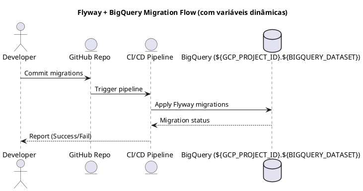

# ✅ Flyway com BigQuery – Estrutura de Migrations e CI/CD (Dinâmico)

Este projeto demonstra como usar **Flyway** para versionamento de esquema e tabelas no **Google BigQuery**, utilizando **variáveis de ambiente** para permitir configuração dinâmica em diferentes ambientes (dev, stage, prod).

✔ Estrutura de pastas  
✔ Exemplo de migrations com placeholders  
✔ Configuração dinâmica com variáveis  
✔ Execução local  
✔ Pipeline CI/CD (GitHub Actions e Azure DevOps)  
✔ Fluxo visual com PlantUML  

---

## 📂 Estrutura do Projeto

```
flyway-bigquery/
├── migrations/                # Scripts SQL versionados pelo Flyway
│   ├── V1__create_dataset.sql
│   ├── V2__create_table_customers.sql
│
├── conf/
│   ├── flyway.conf            # Configuração do Flyway
│
├── scripts/
│   ├── run-migrations.sh      # Script para rodar migrations
│
├── ci-cd/
│   ├── github-actions.yml     # Pipeline GitHub Actions
│   ├── azure-pipelines.yml    # Pipeline Azure DevOps
│
├── diagrams/
│   ├── flow.puml              # Diagrama do fluxo com PlantUML
│
└── README.md                  # Este documento
```

---

## ✅ Variáveis de Ambiente Utilizadas

| Variável                          | Descrição                                     |
|---------------------------------|-----------------------------------------------|
| `GCP_PROJECT_ID`                | ID do projeto no Google Cloud                |
| `BIGQUERY_DATASET`              | Nome do dataset BigQuery para migrations     |
| `GOOGLE_APPLICATION_CREDENTIALS`| Caminho para a chave JSON do Service Account |

**Exemplo:**
```bash
export GCP_PROJECT_ID="meu-projeto"
export BIGQUERY_DATASET="meu_dataset"
export GOOGLE_APPLICATION_CREDENTIALS="/caminho/key.json"
```

---

## ⚙️ **Configuração Dinâmica no `flyway.conf`**

```properties
flyway.url=jdbc:bigquery://https://www.googleapis.com/bigquery/v2:443;ProjectId=${GCP_PROJECT_ID};DefaultDataset=${BIGQUERY_DATASET};OAuthType=3
flyway.user=no-user-needed
flyway.locations=filesystem:./migrations
flyway.schemas=${BIGQUERY_DATASET}
flyway.table=flyway_schema_history
flyway.placeholders.dataset=${BIGQUERY_DATASET}
```

---

## 🛠 **Exemplo de Migrations com Placeholder**

**`migrations/V1__create_dataset.sql`**
```sql
CREATE SCHEMA IF NOT EXISTS ${dataset};
```

**`migrations/V2__create_table_customers.sql`**
```sql
CREATE TABLE IF NOT EXISTS ${dataset}.customers (
    customer_id STRING,
    name STRING,
    created_at TIMESTAMP
);
```

---

## ▶ **Execução Local**

```bash
export GCP_PROJECT_ID="meu-projeto"
export BIGQUERY_DATASET="meu_dataset"
export GOOGLE_APPLICATION_CREDENTIALS="/caminho/key.json"

flyway -configFiles=conf/flyway.conf migrate
```

Ou usando script:
```bash
./scripts/run-migrations.sh
```

---

## 🔄 **Pipeline CI/CD Dinâmico**

### ✅ **GitHub Actions (`ci-cd/github-actions.yml`)**
```yaml
name: Flyway BigQuery Migration

on:
  push:
    branches: [ "main" ]

jobs:
  migrate:
    runs-on: ubuntu-latest
    steps:
      - uses: actions/checkout@v3

      - name: Instalar Flyway
        run: |
          curl -L https://repo1.maven.org/maven2/org/flywaydb/flyway-commandline/9.16.0/flyway-commandline-9.16.0-linux-x64.tar.gz | tar xz
          sudo ln -s `pwd`/flyway-9.16.0/flyway /usr/local/bin/flyway

      - name: Configurar variáveis e rodar migrations
        run: |
          echo '${{ secrets.GCP_KEY }}' > gcp-key.json
          export GOOGLE_APPLICATION_CREDENTIALS=$(pwd)/gcp-key.json
          export GCP_PROJECT_ID=${{ secrets.GCP_PROJECT_ID }}
          export BIGQUERY_DATASET=${{ secrets.BIGQUERY_DATASET }}
          ./scripts/run-migrations.sh
```

---

### ✅ **Azure DevOps (`ci-cd/azure-pipelines.yml`)**
```yaml
trigger:
  branches:
    include:
      - main

pool:
  vmImage: 'ubuntu-latest'

steps:
  - checkout: self

  - script: |
      curl -L https://repo1.maven.org/maven2/org/flywaydb/flyway-commandline/9.16.0/flyway-commandline-9.16.0-linux-x64.tar.gz | tar xz
      sudo ln -s `pwd`/flyway-9.16.0/flyway /usr/local/bin/flyway
    displayName: 'Instalar Flyway'

  - script: |
      echo '$(GCP_KEY)' > gcp-key.json
      export GOOGLE_APPLICATION_CREDENTIALS=$(System.DefaultWorkingDirectory)/gcp-key.json
      export GCP_PROJECT_ID=$(GCP_PROJECT_ID)
      export BIGQUERY_DATASET=$(BIGQUERY_DATASET)
      ./scripts/run-migrations.sh
    displayName: 'Executar migrations'
```

---

## ✅ **Fluxo Visual (PlantUML)**



---

## ✅ **Melhores Práticas**
- Nunca hardcode project/dataset → use variáveis.
- Criar migrations idempotentes (`IF NOT EXISTS`).
- Diferenciar ambientes com variáveis do pipeline.
- Adicionar notificações (Slack, email) no pipeline.

---

## ✅ **Rollback**
BigQuery não suporta rollback automático. Para reverter, crie uma migration inversa:
```sql
DROP TABLE IF EXISTS ${dataset}.customers;
```

---

✔ Estrutura dinâmica pronta  
✔ Pipelines configurados  
✔ Placeholders Flyway aplicados  


```sh
 docker run --rm \
  --env-file .env \
  -e GOOGLE_APPLICATION_CREDENTIALS=/opt/google/key.json \
  -v /home/ac/local/gcp/study-gcp-398200.json:/opt/google/key.json \
  -v ./migrations:/flyway/sql \
  -v ./conf:/opt/conf \
  flyway/flyway -configFiles=/opt/conf/flyway.conf info

docker run --rm \
-v $(pwd):/flyway/project \
flyway/flyway -workingDirectory="/flyway/project " info


```
